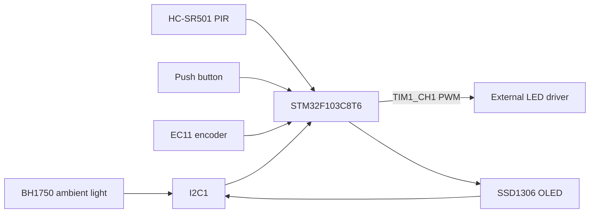

# SmartDeskLamp

A public, reproducible firmware reference for a sensor-aware desk lamp built around the **STM32F103C8T6**.

The project combines ambient-light feedback, presence detection, manual input, PWM dimming, and a small OLED user interface in a self-contained embedded system. It is intended for learning, experimentation, and community improvement—not as a mains-voltage or safety-certified consumer product.

> 中文简介：这是一个基于 STM32F103C8T6 的智能台灯固件项目，支持 BH1750 环境光自动调光、HC-SR501 人体检测、EC11 编码器手动调光、按键控制和 SSD1306 OLED 状态显示。项目源于本科毕业设计，现整理为便于复现和协作的公开嵌入式参考工程。

> **Status:** prototype; documentation, build cleanup, and hardware reproducibility are in progress.

## What the project does

SmartDeskLamp keeps the lighting loop local to the microcontroller:

- **Automatic mode**: reads BH1750 illuminance and nudges the target brightness toward a 500 lux setpoint.
- **Manual mode**: a rotary EC11 encoder adjusts the brightness level and takes precedence over automatic control.
- **Presence-aware power**: an HC-SR501 signal clears the idle timer; after roughly 60 seconds without presence, the lamp fades toward off and can wake when presence returns.
- **Smooth dimming**: a 0–199 logical brightness level is ramped toward its target and mapped through a cubic gamma approximation to a 0–1000 PWM compare value.
- **Low-flicker UI**: a 128×64 SSD1306 OLED draws static labels once and refreshes only changed fields.
- **No cloud dependency**: sensing, control, and display updates run on the STM32.

## Architecture



The application is organized as a small time-sliced scheduler rather than an RTOS task set:

| Period | Responsibility |
| --- | --- |
| 10 ms | Debounced button events, encoder events, and smooth PWM ramping |
| 100 ms | Presence sampling and idle-timeout power policy |
| 200 ms | Filtered BH1750 read and automatic brightness adjustment |
| 500 ms | OLED dynamic-field refresh |

## User interaction

| Input | Behavior |
| --- | --- |
| Short press | Toggle the lamp; turning it back on restores the default brightness level when needed |
| Long press (about 800 ms) | Toggle automatic/manual mode |
| Rotate encoder while on | Change the target brightness by one level per processed step and switch to manual mode |
| Presence detected | Clear the idle timer; wake the lamp if it was automatically turned off |

The automatic controller uses a 500 lux target with a 30 lux upper deadband. BH1750 samples are averaged over five readings before the value is used by the control loop.

## Hardware and wiring

The firmware currently uses the following connections. The LED load must be driven through an appropriate current-limited driver or MOSFET stage; do not connect a high-current or mains load directly to an STM32 pin.

| MCU pin | Function | Notes |
| --- | --- | --- |
| PA0 | EC11 A phase | EXTI0, rising and falling edges |
| PA1 | EC11 B phase | Pull-up input |
| PB6 | I2C1 SCL | Shared by BH1750 and SSD1306 |
| PB7 | I2C1 SDA | Shared by BH1750 and SSD1306 |
| PA8 | TIM1 channel 1 PWM | Approx. 9 kHz, compare range 0–999 |
| PB12 | Push button | Active-low, pull-up input |
| PB13 | HC-SR501 output | Digital input with pull-down |
| PA13 | SWDIO | Programming/debugging |
| PA14 | SWCLK | Programming/debugging |
| PD0 / PD1 | HSE oscillator | External high-speed crystal |

Known device addresses in the source are **BH1750: 0x23** and **SSD1306: 0x3C** (7-bit notation).

## Repository layout

```text
Core/
  Inc/                 Public module headers
  Src/
    main.c             State machine and periodic scheduler
    bh1750.c           Ambient-light acquisition and five-sample filter
    hcsr501.c          Presence input
    ec11.c             Interrupt-assisted rotary encoder decoding
    key.c              Button debouncing and short/long press events
    pwm_ctrl.c         TIM1 PWM abstraction
    oled.c              SSD1306 driver, fonts, and partial redraw helpers
    gpio.c/i2c.c/tim.c CubeMX/HAL peripheral setup
Drivers/               STM32F1 HAL and CMSIS sources
cmake/                 GCC Arm toolchain and STM32CubeMX CMake glue
docs/
  code_walkthrough.md  Code-oriented explanation of the control flow
  defense_qa.md        Design rationale and project FAQ (Chinese)
smartdesklamp.ioc      STM32CubeMX project configuration
```

## Build

The project is configured for the **GNU Arm Embedded Toolchain**, **CMake 3.22+**, and **Ninja**.

1. Install `arm-none-eabi-gcc`, CMake, and Ninja and make sure all three commands are on `PATH`.
2. Configure and build a Debug image:

   ```bash
   cmake --preset Debug
   cmake --build --preset Debug --parallel
   ```

3. The expected firmware image is:

   ```text
   build/Debug/smartdesklamp.elf
   ```

For a release-oriented image, use the corresponding `Release` preset. The repository does not currently provide a CI workflow, so builds should be verified in a toolchain-enabled environment before making a release.

## Flash and debug

Connect an ST-Link or another SWD probe to **SWDIO (PA13)**, **SWCLK (PA14)**, **3.3 V**, and **GND**. For example, with STM32CubeProgrammer:

```bash
STM32_Programmer_CLI -c port=SWD -w build/Debug/smartdesklamp.elf -v -rst
```

The exact flashing command depends on the probe and host installation. Always verify the LED driver, supply voltage, and current limit independently of the firmware.

## Development notes and current limitations

This repository is being documented as a reproducible embedded-systems reference. The following items are intentionally called out so contributors can improve the project without guessing:

- **First-build macro check**: `Core/Src/main.c` defines `DEADBAND` but the automatic-control expression currently refers to `UPPER_DEADBAND`. Align the name before the first compiler build.
- **CubeMX configuration drift**: the hand-maintained source currently uses PA0/PA1 and PB12/PB13, while parts of `smartdesklamp.ioc` still describe an older pin arrangement. Reconcile the `.ioc` and source GPIO mapping before regenerating code with CubeMX.
- **Hardware documentation**: a complete schematic, PCB, enclosure, and validated LED-driver reference design are not included yet.
- **Verification**: there is no host-side test harness or automated firmware test suite at present. Contributions that extract the control policy into testable code are welcome.
- **Licensing**: there is not yet a project-level license file. See the license section below before redistributing or accepting external contributions.

## Documentation

- [Code walkthrough](docs/code_walkthrough.md) — a module-by-module explanation of the scheduler and control loop.
- [Defense Q&A](docs/defense_qa.md) — design rationale and frequently asked technical questions (Chinese).

## Contributing

Issues and pull requests are welcome. Useful contributions include:

- synchronizing the CubeMX `.ioc` file with the current GPIO implementation;
- fixing and testing the build configuration;
- adding a schematic, wiring diagram, or a safe low-voltage LED-driver example;
- adding CI for the Arm GCC/CMake build;
- extracting the auto-dimming and presence policies into host-testable modules;
- improving English and Chinese documentation.

When submitting a change, describe the board revision, sensor modules, toolchain version, and how the change was tested. Hardware changes should include a pin table and a wiring note.

## Safety

This is experimental low-voltage firmware. It does not provide electrical isolation, thermal protection, current regulation, or certification. Use a suitable external LED driver, observe the ratings of the STM32 and sensor modules, and keep mains-voltage work outside the scope of this repository unless it is designed and reviewed by a qualified professional.

## License and third-party notices

No project-level license has been selected yet. Before publishing releases or accepting outside contributions, add an OSI-approved license for the application code and keep the upstream notices for the STM32 HAL/CMSIS sources under `Drivers/`. Until then, treat the repository as source-available for evaluation rather than as a blanket grant of redistribution rights.

## Project context

SmartDeskLamp started as an undergraduate capstone project and is now being cleaned up as a public learning resource. The goal is to make the embedded control decisions easy to inspect, reproduce, and extend—especially for contributors who are learning STM32 peripherals, sensor fusion, timing, and human-centered control behavior.
